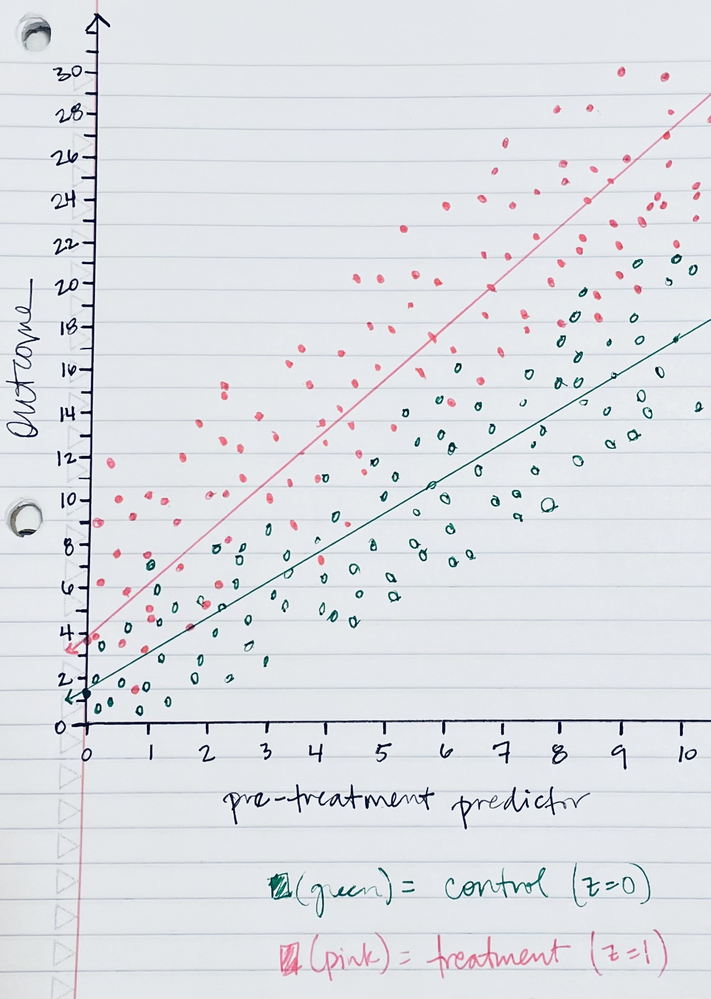

```{r setup, include=FALSE}
knitr::opts_chunk$set(echo = TRUE)
pacman::p_load("bayesplot","knitr","arm","ggplot2","rstanarm")
```

## 7.2 Fake-data simulation and regression:

Simulate 100 data points from the linear model, $y =  a + bx$ + error, with $a = 5$, $b = 7$, the values of $x$ being sampled at random from a uniform distribution on the range $[0, 50]$, and errors that are normally distributed with mean 0 and standard deviation 3.

### 7.2a

Fit a regression line to these data and display the output.

```{r}
set.seed(123)

a <- 5
b <- 7 
sigma <- 3

x <- runif(n = 100, min = 0, max = 50)
n <- length(x)

y <- a + b*x + rnorm(n, 0, sigma)
sim_dat <- data.frame(x, y)

fit <- stan_glm(y ~ x, data = sim_dat, refresh = 0)
print(fit)

```

### 7.2b

Graph a scatterplot of the data and the regression line.

```{r}

plot(sim_dat$x, sim_dat$y, main = "Data and fitted regression line")

a_hat <- coef(fit)[1]
b_hat <- coef(fit)[2]
abline(a_hat, b_hat)

```

### 7.2c

Use the `text` function in R to add the formula of the fitted line to the graph.

```{r}

plot(sim_dat$x, sim_dat$y, main = "Data and fitted regression line")

a_hat <- coef(fit)[1]
b_hat <- coef(fit)[2]
abline(a_hat, b_hat)

x_bar <- mean(sim_dat$x)
text(x_bar, a_hat + b_hat*x_bar, paste("y =", round(a_hat, 2), "+", round(b_hat, 2), "* x"), adj = -.5)

```

## 7.3 Fake-data simulation and fitting the wrong model:

Simulate 100 data points from the model $y = a + b x + c x^2$ + error, with the values of $x$ being sampled at random from a uniform distribution on the range $[0, 50]$, errors that are normally distributed with mean 0 and standard deviation 3, and $a$, $b$, $c$ chosen so that a scatterplot of the data shows a clear nonlinear curve.

### 7.3 a

Fit a regression line `stan_glm(y ~ x)` to these data and display the output.

```{r}
set.seed(123)

a <- 5
b <- 7
c <- 10
sigma <- 3

x <- runif(n = 100, min = 0, max = 50)
n <- length(x)

y <- a + b*x + c*x^2 + rnorm(n, 0, sigma)
sim_dat <- data.frame(x, y)

fit <- stan_glm(y ~ x, data = sim_dat, refresh = 0)
print(fit)

```

### 7.3b

Graph a scatterplot of the data and the regression line. This is the best-fit linear regression. What does “best-fit” mean in this context?

ANSWER:

Below you see the scatter plot and the best-fit regression line. For this problem, when you see the graph, you can see a distinct curve to the data, which tells us that the assumption of linearity is not being met, thus, this best-fit regression line is invalid. The best-fit linear regression line in this context is not helpful.

```{r}

plot(sim_dat$x, sim_dat$y, main = "Data and fitted regression line")

a_hat <- coef(fit)[1]
b_hat <- coef(fit)[2]
abline(a_hat, b_hat)

```

## 7.6 Formulating comparisons as regression models:

Take the election forecasting model and simplify it by creating a binary predictor defined as $x = 0$ if income growth is less than 2% and $x = 1$ if income growth is more than 2%.

```{r}

hibbs <- read.table(url("https://raw.githubusercontent.com/avehtari/ROS-Examples/master/ElectionsEconomy/data/hibbs.dat"), header=TRUE)

hibbs$x <- ifelse(hibbs$growth > 2, 1, 0)

hibbs

```

### 7.6a

Compute the difference in incumbent party's vote share on average, comparing those two groups of elections, and determine the standard error for this difference.

```{r}

mean_1 <- mean(hibbs$vote[hibbs$x == 1])
mean_0 <- mean(hibbs$vote[hibbs$x == 0])

std_dev_0 <- sd(hibbs$vote[hibbs$x == 0])
std_dev_1 <- sd(hibbs$vote[hibbs$x == 1])

diff_means <- mean_1 - mean_0

n1 <- sum(hibbs$x == 1)
n0 <- sum(hibbs$x == 0)

std_error_diff <- sqrt(std_dev_0^2/n0 + std_dev_1^2/n1)

cat("the difference in means is:",  diff_means, "\n")
cat("the standard error is:", std_error_diff,  "\n")

```

### 7.6b

Regress incumbent party's vote share on the binary predictor of income growth and check that the resulting estimate and standard error are the same as above.

```{r}

fit <- lm(hibbs$vote ~ hibbs$x, data = hibbs)
summary(fit)

```

## 8.8 Comparing lm and stan_glm:

Use simulated data to compare least squares estimation to default Bayesian regression:

### 8.8a

Simulate 100 data points from the model, $y = 2 + 3x$ + error, with predictors $x$ drawn from a uniform distribution from 0 to 20 and with independent errors drawn from the normal distribution with mean 0 and standard deviation 5. Fit the regression of $y$ on $x$ data using `lm` and `stan_glm` (using its default settings) and check that the two programs give nearly identical results.

```{r}
set.seed(123)

a <- 2
b <- 3
sigma <- 5

x <- runif(n = 100, min = 0, max = 20)
n <- length(x)

y <- a + b*x + rnorm(n, 0, sigma)
sim_dat <- data.frame(x, y)

fit_1 <- stan_glm( y ~ x, data = sim_dat, refresh = 0)
print(fit_1)

fit_2 <- lm( y ~ x, data = sim_dat)
print(fit_2)


```

### 8.8b

Plot the simulated data and the two fitted regression lines.

```{r}

plot(sim_dat$x, sim_dat$y, main = "Data and fitted regression line")

a_hat_1 <- coef(fit_1)[1]
b_hat_1 <- coef(fit_1)[2]
abline(a_hat_1, b_hat_1, col = "blue")

a_hat_2 <- coef(fit_2)[1]
b_hat_2 <- coef(fit_2)[2]
abline(a_hat_2, b_hat_2, col = "red")

```

### 8.8c

Repeat the two steps above, but try to create conditions for your simulation so that `lm` and `stan_glm` give much different results.

```{r}
set.seed(34)

a <- 2
b <- 3
sigma <- 5

x <- runif(n = 2, min = 0, max = 100)
n <- length(x)

y <- a + b*x + rnorm(n, 0, sigma)
sim_dat <- data.frame(x, y)

fit_1 <- stan_glm( y ~ x, data = sim_dat, refresh = 0)
print(fit_1)

fit_2 <- lm( y ~ x, data = sim_dat)
print(fit_2)

plot(sim_dat$x, sim_dat$y, main = "Data and fitted regression line")

a_hat_1 <- coef(fit_1)[1]
b_hat_1 <- coef(fit_1)[2]
abline(a_hat_1, b_hat_1, col = "blue")

a_hat_2 <- coef(fit_2)[1]
b_hat_2 <- coef(fit_2)[2]
abline(a_hat_2, b_hat_2, col = "red")


```

## 10.1 Regression with interactions:

Simulate 100 data points from the model, $y = b_0 + b_1 x +  b_2 z + b_3 x z$ + error, with a continuous predictor $x$ and a binary predictor $z$, coefficients $b = c(1, 2, -1, -2)$, and errors drawn independently from a normal distribution with mean 0 and standard deviation 3, as follows. For each data point $i$, first draw $z_i$, equally likely to take on the values 0 and 1. Then draw $x_i$ from a normal distribution with mean $z_i$ and standard deviation 1. Then draw the error from its normal distribution and compute $y_i$.

### 10.1a

Display your simulated data as a graph of $y$ vs $x$, using dots and circles for the points with $z$ = 0 and 1, respectively.

```{r}

set.seed(56)

n <- 100
b <- c(1, 2, -1, -2)
sigma <- 3

z <- rbinom(n, 1, p = 0.5)
x <- rnorm(n, mean = z, sd = 1)

y <- b[1] + b[2]*x + b[3]*z + b[4]*x*z + rnorm(n, 0, sigma)

sim_dat <- data.frame(x, y)

plot(sim_dat$x, sim_dat$y, pch = ifelse(z == 0, 16, 1))

```

### 10.1b

Fit a regression predicting $y$ from $x$ and $z$ with no interaction. Make a graph with the data and two parallel lines showing the fitted model.

```{r}

plot(sim_dat$x, sim_dat$y, pch = ifelse(z == 0, 16, 1), main = "Data and fitted regression line")

fit_1 <- lm(y ~ x + z, data = sim_dat)
print(fit_1)

b_hat_x <- coef(fit_1)[2]

a_hat_z0 <- coef(fit_1)[1] + coef(fit_1)[3]*0
a_hat_z1 <- coef(fit_1)[1] + coef(fit_1)[3]*1


abline(a_hat_z0, b_hat_x, col = "blue")
abline(a_hat_z1, b_hat_x, col = "red")

```

### 10.1c

Fit a regression predicting $y$ from $x$, $z$, and their interaction. Make a graph with the data and two lines showing the fitted model.

```{r}

plot(sim_dat$x, sim_dat$y, pch = ifelse(z == 0, 16, 1), main = "Data and fitted regression line")

fit_2 <- lm(y ~ x + z + x*z, data = sim_dat)
print(fit_2)

x_seq <- seq(min(x), max(x), length(100))
y_hat_z0 <- coef(fit_2)[1] + coef(fit_2)[2]*x_seq + coef(fit_2)[3]*0 + coef(fit_2)[4]*x_seq*0
y_hat_z1 <- coef(fit_2)[1] + coef(fit_2)[2]*x_seq + coef(fit_2)[3]*1 + coef(fit_2)[4]*x_seq*1

lines(x_seq, y_hat_z0, col = 'blue')
lines(x_seq, y_hat_z1, col = 'red')

```

## 10.2 Regression with interactions:

Here is the output from a fitted linear regression of outcome $y$ on pre-treatment predictor $x$, treatment indicator $z$, and their interaction:

```{verbatim}
            Median MAD_SD
(Intercept) 1.2    0.2
x           1.6    0.4
z           2.7    0.3
x:z         0.7    0.5

Auxiliary parameter(s):
      Median MAD_SD
sigma 0.4    0.0
```

### 10.2a

Write the equation of the estimated regression line of $y$ on $x$ for the treatment group and the control group, and the equation of the estimated regression line of $y$ on $x$ for the control group.

ANSWER:

I will make the assumption that the treatment indicator is a binary variable with z = 0 meaning control group(no treatment) and z = 1 meaning treatment group.

Here would be the general equation: $\hat{y} = \beta_0 + \beta_1 x + \beta_2 z + \beta_3 xz$

For the control group, we substitute z = 0, then the coefficients: $\hat{y} = \beta_0 + \beta_1 x + \beta_2 * 0 + \beta_3 x*0$

so thus the estimated regression line for the control group is: $\hat{y} = 1.2 + 1.6x$

For the treatment group, we substitute z = 1, then the coefficients: $\hat{y} = \beta_0 + \beta_1 x + \beta_2 * 1 + \beta_3 x*1$

so then we get to do some simplifying: $\hat{y} = 1.2 + 1.6 x + 2.7 * 1 + 0.7 x*1$

and the equation for the treatment group is: $\hat{y} = 3.9 + 2.3x$

```{r}
```

### 10.2b

Graph with pen on paper the two regression lines, assuming the values of $x$ fall in the range $(0, 10)$. On this graph also include a scatter plot of data (using open circles for treated units and dots for controls) that are consistent with the fitted model.

ANSWER:

Below is my hand drawn graph expressing the two regression lines and possible scatterplot. I accidentally drew the open circles for controls and closed dots for treatments. It did not seem worth my time to redo the entire drawing.



.

```{r}


```

## 10.5 Regression modeling and prediction:

The folder `KidIQ` contains a subset of the children and mother data discussed earlier in the chapter. You have access to children's test scores at age 3, mother's education, and the mother's age at the time she gave birth for a sample of 400 children.

```{r}

iq_data <- read.csv(url("https://raw.githubusercontent.com/avehtari/ROS-Examples/master/KidIQ/data/kidiq.csv"), header = TRUE)

```

### 10.5a

Fit a regression of child test scores on mother's age, display the data and fitted model, check assumptions, and interpret the slope coefficient. Based on this analysis, when do you recommend mothers should give birth? What are you assuming in making this recommendation?

```{r}
```

### 10.5b

Repeat this for a regression that further includes mother's education, interpreting both slope coefficients in this model. Have your conclusions about the timing of birth changed?

```{r}
```

### 10.5c

Now create an indicator variable reflecting whether the mother has completed high school or not. Consider interactions between high school completion and mother's age. Also create a plot that shows the separate regression lines for each high school completion status group.

```{r}
```

### 10.5d

Finally, fit a regression of child test scores on mother's age and education level for the first 200 children and use this model to predict test scores for the next 200. Graphically display comparisons of the predicted and actual scores for the final 200 children.

```{r}
```

## 10.6 Regression models with interactions:

The folder `Beauty` contains data (use file `beauty.csv`) from Hamermesh and Parker (2005) on student evaluations of instructors' beauty and teaching quality for several courses at the University of Texas. The teaching evaluations were conducted at the end of the semester, and the beauty judgments were made later, by six students who had not attended the classes and were not aware of the course evaluations.

See also Felton, Mitchell, and Stinson (2003) for more on this topic.

```{r}

evals <-read.csv("https://raw.githubusercontent.com/maharjansudhan/DATA606/master/evals.csv", sep=",")

```

### 10.6a

Run a regression using beauty (the variable `beauty`) to predict course evaluations (`eval`), adjusting for various other predictors. Graph the data and fitted model, and explain the meaning of each of the coefficients along with the residual standard deviation. Plot the residuals versus fitted values.

```{r}
```

### 10.6b

Fit some other models, including beauty and also other predictors. Consider at least one model with interactions. For each model, explain the meaning of each of its estimated coefficients.

```{r}
```

## 10.7 Predictive simulation for linear regression:

Take one of the models from the previous exercise.

### 10.7a

Instructor A is a 50-year-old woman who is a native English speaker and has a beauty score of -1. Instructor B is a 60-year-old man who is a native English speaker and has a beauty score of -0.5. Simulate 1000 random draws of the course evaluation rating of these two instructors. In your simulation, use `posterior_predict` to account for the uncertainty in the regression parameters as well as predictive uncertainty.

```{r}
```

### 10.7b

Make a histogram of the difference between the course evaluations for A and B. What is the probability that A will have a higher evaluation?

```{r}
```

## 10.8 How many simulation draws:

Take the model from Exercise 10.6 that predicts course evaluations from beauty and other predictors.

### 10.8a

Display and discuss the fitted model. Focus on the estimate and standard error for the coefficient of beauty.

```{r}
```

### 10.8b

Compute the median and mad SD of the posterior simulations of the coefficient of beauty, and check that these are the same as the output from printing the fit.

```{r}
```

### 10.8c

Fit again, this time setting `iter` = 1000 in your `stan_glm` call. Do this a few times in order to get a sense of the simulation variability.

```{r}
```

### 10.8d

Repeat the previous step, setting `iter` = 100 and then `iter` = 10.

```{r}
```

### 10.8e

How many simulations were needed to give a good approximation to the mean and standard error for the coefficient of beauty?
